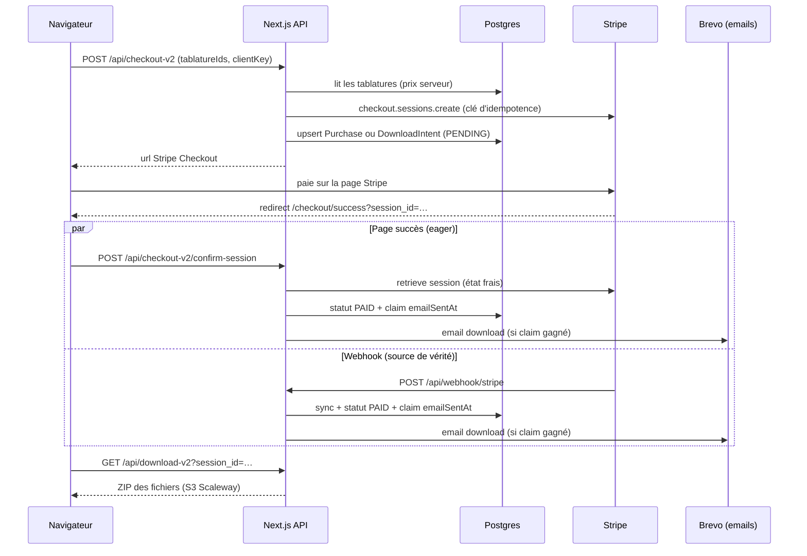

# Flow de paiement — de « Add to cart » au téléchargement

Ce document décrit **tout ce qui se passe** (frontend, backend, base de données, Stripe, emails)
quand un utilisateur achète des tablatures. Il complète [`stripe.md`](./stripe.md) (philosophie
t3dotgg, sync = source de vérité) : ici on suit le parcours chronologique complet.

Deux modes coexistent — voir la table de comparaison dans `stripe.md` §5b :

- **Guest** (non connecté, legacy) : `DownloadIntent` + `Download`, accès aux fichiers par lien
  email `/checkout/download?session_id=…`.
- **Logged-in** (Clerk, cible) : `StripeCustomer` + `Purchase` + `PurchaseItem`, accès aux
  fichiers via `/user/downloads`.

---

## Vue d'ensemble

Le paiement est confirmé par **deux chemins concurrents** (page succès + webhook). C'est voulu
(couvre la race condition « l'utilisateur arrive avant le webhook » et le cas « webhook raté »).
L'email de download est protégé contre le double envoi par un **claim atomique** (voir §6).

---

## 1. Le panier (100 % frontend)

- Le panier vit dans le **localStorage** du navigateur (`app/hooks/useCart.ts`, clé
  `LocalStorageEnum.CART`). Aucune écriture en base à ce stade : un panier abandonné avant
  checkout ne laisse **aucune trace** côté serveur.
- Un event DOM `cartUpdate` est dispatché à chaque modification pour rafraîchir le badge du
  header et les autres composants.
- La page `/checkout` (`app/checkout/components/CheckoutClient.tsx`) recharge les détails des
  tabs depuis `POST /api/tablatures/batch` (les prix affichés viennent du serveur, pas du
  localStorage).

## 2. Création de la session Checkout — `POST /api/checkout-v2`

Déclenché par « Proceed to Payment » (`CheckoutTable.tsx`, `handleCheckout`). Le client envoie
`{ orderItems: { tablatureIds }, clientKey }` — `clientKey` est un identifiant stable par
navigateur utilisé pour l'idempotence des visiteurs anonymes.

Côté serveur (`app/api/checkout-v2/route.ts`) :

1. **Validation** (zod) + relecture des tablatures en base (`hidden: false`). Les prix viennent
   de la DB — jamais du client.
2. **Logged-in seulement** : refus si une des tabs est déjà achetée (`getUserPurchasedTablatures`),
   et création du customer Stripe **avant** le checkout (`ensureCustomerBeforeCheckout` →
   table `StripeCustomer`, pattern t3dotgg).
3. **Session Stripe** créée avec une **clé d'idempotence** = SHA-256 de
   (scope = `userId` ou `clientKey`) + params complets de la session. Re-cliquer « Proceed to
   Payment » avec le même panier renvoie **la même session** au lieu d'en créer une nouvelle
   (fini les sessions dupliquées après un retour arrière depuis Stripe). Si la session rejouée
   n'est plus `open` (payée/expirée), on en crée une fraîche.
   Pas de `expires_at` custom : défaut Stripe = **24 h** (30 min était trop court pour les
   redirections PayPal).
4. **Écriture DB (upsert, statut `PENDING`)** :
   - logged-in → `Purchase` + `PurchaseItem` (un par tab, prix figé `priceAtPurchase`) ;
   - guest → `DownloadIntent` (`success: null`) + `Download` (un par tab).
   L'upsert sur `stripeSessionId` garantit une seule ligne par session même en cas de reuse.
5. Réponse `{ url }` → le navigateur est redirigé vers la page de paiement **hébergée par
   Stripe** (on ne voit jamais la carte).

Les `tablatureIds` sont embarqués dans les `metadata` de la session et de chaque
`product` Stripe (`tabId`) — c'est ce qui permet à la sync de reconstruire un `Purchase` depuis
Stripe seul.

## 3. Le paiement chez Stripe — deux familles de moyens de paiement

- **Synchrones** (carte bancaire) : le résultat est connu immédiatement.
  `checkout.session.completed` arrive avec `payment_status: 'paid'`.
- **À notification différée** (PayPal, Klarna, Bancontact, EPS…) :
  `checkout.session.completed` arrive avec `payment_status: 'unpaid'` (le client a fini le
  parcours mais l'argent n'est pas confirmé), puis **quelques secondes à plusieurs heures plus
  tard** : `checkout.session.async_payment_succeeded` **ou** `…async_payment_failed`.
  ⚠️ Stripe **n'envoie aucun email au client** en cas d'échec async — c'est nous (§6).

Issues possibles d'une session :
| Événement Stripe | Statut DB (`Purchase.status` / `DownloadIntent.status`) |
|---|---|
| `completed` avec `paid` | `PAID` |
| `completed` avec `unpaid` (async en cours) | reste `PENDING` |
| `async_payment_succeeded` | `PAID` |
| `async_payment_failed` | `FAILED` (+ email d'échec) |
| `checkout.session.expired` (24 h sans payer) | `CANCELLED` |
| jamais ouverte/abandonnée avant 24 h | `expired` arrive quand même → `CANCELLED` |

## 4. Le webhook — `POST /api/webhook/stripe`

1. **Vérifie la signature** (`STRIPE_WEBHOOK_SECRET`), répond `200` immédiatement, puis traite
   en arrière-plan via `after()` (survit à la fermeture de la connexion).
2. Filtre sur `ALLOWED_EVENTS` (checkout.session.\*, payment_intent.\*, charge.\*, customer.\*).
3. **Logged-in** (event avec `customer` ID) : appelle `updateDatabaseWithLatestStripeData` —
   la fonction de sync re-fetch **tout l'état frais** chez Stripe et upsert les `Purchase`
   (on ne fait pas confiance au payload du webhook, voir `stripe.md`).
4. **Guest** (pas de customer ID) : la sync est sautée, mais les events checkout passent quand
   même pour mettre à jour `DownloadIntent`.
5. Selon l'event : `handlePaidSession()` (→ `PAID` + email download), `FAILED` + email d'échec,
   ou `CANCELLED`. `updatePurchaseStatus()` écrit **les deux tables** (Purchase + DownloadIntent)
   pour couvrir les deux modes ; sur DownloadIntent il maintient aussi le champ legacy `success`
   (true/false/null) et backfill l'`email` depuis `session.customer_details`.

C'est le webhook qui remplit `DownloadIntent.email` : Stripe exige un email pour payer, donc
**toute session réellement payée a un email**. Les `DownloadIntent` sans email sont des paniers
jamais payés (l'email n'est jamais parvenu jusqu'à nous).

## 5. La page de succès — `/checkout/success`

`ConfirmStripeSession.tsx` appelle `POST /api/checkout-v2/confirm-session` dès l'arrivée :

- La route re-fetch la session chez Stripe (jamais confiance au query param seul).
- **`paid`** → marque `PAID` (upsert du statut, backfill email guest), tente l'envoi de l'email
  (fallback si le webhook a été raté, voir §6), vide le panier (une seule fois), affiche le
  bouton de téléchargement (`DownloadZipButton`, démarrage auto).
- **`unpaid` mais session `complete`** (paiement async en cours) → réponse `202 {pending}` :
  la page affiche « paiement en cours de confirmation », **poll toutes les 5 s (max 10 min)** et
  bascule automatiquement en succès/échec quand le webhook a tranché. Si la DB dit déjà
  `FAILED` → réponse `402 {failed}` et écran d'échec.
- **Logged-in** : force aussi une sync Stripe complète (`triggerStripeSyncForUser`) pour que
  `/user/downloads` soit à jour immédiatement.

## 6. Les emails (Brevo) — exactement une fois

`services/transactional-emails.ts` :

- **Email de download** (template Brevo 1, lien `/checkout/download?session_id=…`) : envoyé par
  `sendDownloadEmailOnce()`. Webhook, retries de webhook et page succès peuvent tous l'appeler ;
  un seul gagne grâce au **claim atomique** sur la colonne `emailSentAt`
  (`updateMany where {status: PAID, emailSentAt: null}` — seul l'appelant dont le count vaut 1
  envoie). Si l'envoi Brevo échoue, le claim est **relâché** pour qu'un chemin suivant retente.
- **Email d'échec de paiement** (template 2, override `BREVO_PAYMENT_FAILED_TEMPLATE_ID`) :
  envoyé sur `async_payment_failed` uniquement (Stripe ne prévient pas le client lui-même).

## 7. Le téléchargement — `GET /api/download-v2`

Deux autorisations possibles :

- **`?session_id=`** (guest + lien email) : `canDownloadSession()`
  (`services/purchase-verification.ts`) vérifie DownloadIntent → Purchase → fallback live
  Stripe pour les vieilles sessions `success: null`.
- **`?tablature_ids=`** (logged-in, depuis `/user/downloads`) : `verifyUserPurchase()` vérifie
  en base que l'utilisateur a bien acheté ces tabs.

Puis la route construit un **ZIP en mémoire** (JSZip) : un dossier par tablature, fichiers
téléchargés depuis Scaleway S3 via URLs signées (1 h). C'est long (plusieurs secondes) →
côté client `DownloadZipButton.tsx` verrouille le bouton (ref `inFlight`) et affiche un spinner
pour empêcher les téléchargements multiples.

## 8. Récapitulatif des écritures DB par étape

| Étape | Guest | Logged-in |
|---|---|---|
| Panier | — (localStorage) | — (localStorage) |
| `POST /api/checkout-v2` | `DownloadIntent(PENDING)` + `Download`×N | `StripeCustomer` (si 1er achat), `Purchase(PENDING)` + `PurchaseItem`×N |
| Webhook paid / page succès | `status=PAID`, `success=true`, `email` backfillé, `emailSentAt` | `status=PAID`, `emailSentAt` (+ sync complète des sessions du customer) |
| Échec async | `status=FAILED`, `success=false` | `status=FAILED` |
| Expiration 24 h | `status=CANCELLED` | `status=CANCELLED` |

## 9. Outils de diagnostic

- `npm run reconcile-intents` (`scripts/reconcile-download-intents.ts`) : classe chaque
  `DownloadIntent` non conclu via l'API Stripe (ABANDONED / LOST_PAYMENT / STILL_OPEN /
  ASYNC_UNSETTLED), et répare avec `--apply` (statut + email + lien de download). Dry-run par
  défaut.
- `stripe listen --forward-to localhost:3000/api/webhook/stripe` + `stripe trigger …` pour
  rejouer les events en local.
- Logs Prisma verbeux : opt-in via `PRISMA_LOG_QUERIES=1` (`app/prisma.ts`).
